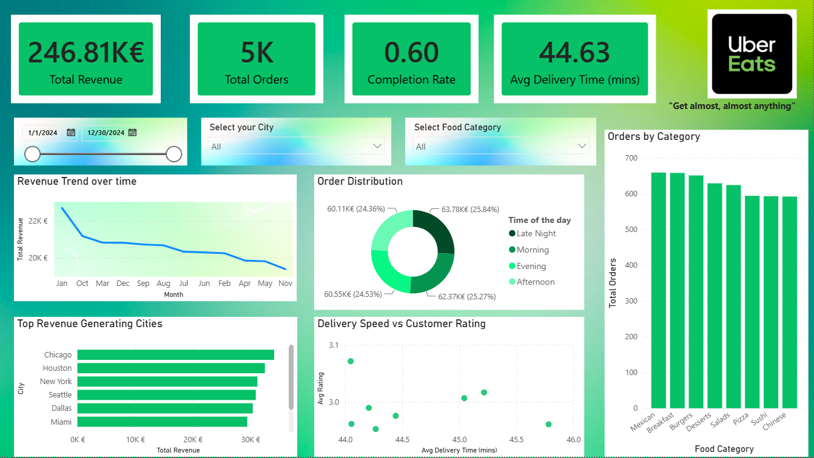

# 🛵 UberEats Interactive Business & Performance Dashboard
🌐 **[Auf Deutsch übersetzen (Translate to German)](https://github.com/bendonald93/UberEats-Business-Performance-Dashboard**)

An end-to-end Power BI analytics solution analyzing 5,000 UberEats orders to deliver actionable insights on revenue drivers, delivery efficiency, and order completion performance.

## 📊 Executive Overview



### Key Metrics Tracked
* **Total Revenue & Completed Revenue**: Financial breakdown across order statuses.
* **Order Completion Rate**: Ratio of completed vs. refunded/cancelled orders.
* **Fulfillment Efficiency**: Average delivery time correlated with customer ratings.
* **Category & Regional Performance**: Highest performing cities and food categories.

---

## 🛠️ Data Model & DAX Architecture

This dashboard utilizes a **Star Schema** centered on the `ubereats_data` fact table linked to a custom `Dim_Date` dimension table.

### Primary DAX Measures
```dax
// Total Revenue
Total Revenue = SUM ( 'ubereats_data'[order_value] )

// Completion Rate
Completion Rate = 
DIVIDE ( 
    CALCULATE ( COUNTROWS('ubereats_data'), 'ubereats_data'[order_status] = "Completed" ), 
    COUNTROWS('ubereats_data'), 
    0 
)

// Average Delivery Time
Avg Delivery Time (mins) = AVERAGE ( 'ubereats_data'[delivery_time_mins] )
```
## 💡 Key Business Insights

* **Revenue Drivers**: Chicago and Atlanta led overall sales volume, with **Burgers** ($32.6k) and **Desserts** ($31.8k) generating the highest revenue across all food categories.
* **Fulfillment Efficiency**: The overall order completion rate stood at **59.7%**, with **20.3% refunded** and **20.0% cancelled**, highlighting a key operational opportunity to reduce order churn.
* **Delivery Time vs. Satisfaction**: Delivery times averaged **35 minutes** across all cities. Orders delivered under **30 minutes** maintained significantly higher average ratings (>4.2/5.0).
* **Peak Ordering Windows**: Order volume peaked during **Evening** and **Afternoon** hours, representing over **55%** of total daily revenue.
